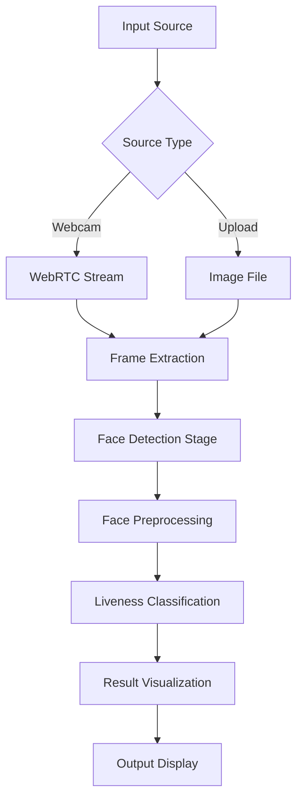
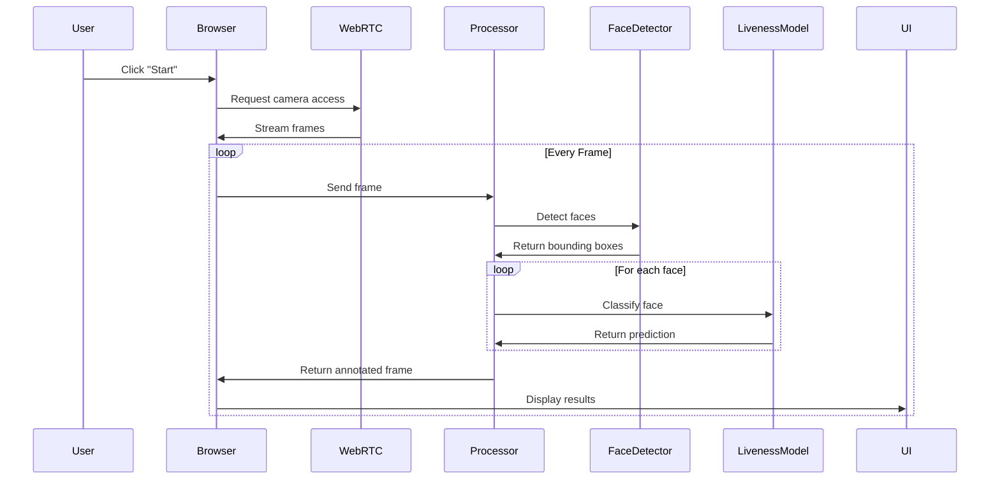
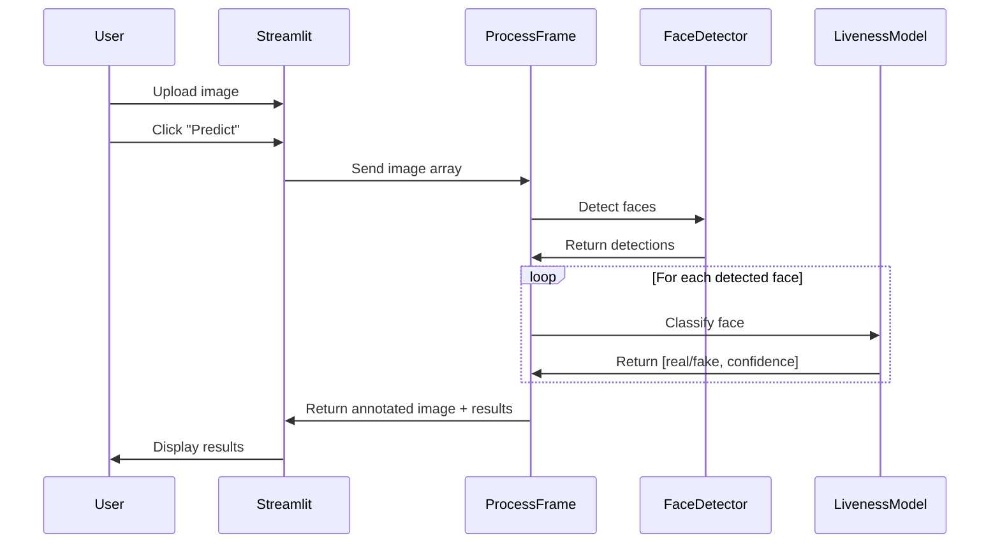
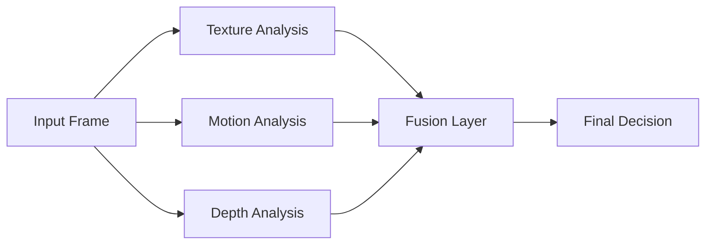

# 🏗️ EyeDentify - System Architecture

This document provides an in-depth technical overview of the EyeDentify face liveness detection system architecture.

---

## Table of Contents

1. [System Overview](#system-overview)
2. [Component Architecture](#component-architecture)
3. [Data Flow](#data-flow)
4. [Model Architecture](#model-architecture)
5. [Code Structure](#code-structure)
6. [Performance Optimization](#performance-optimization)

---

## System Overview

EyeDentify is a two-stage detection pipeline that combines face detection with liveness classification:



### Key Design Principles

1. **Modularity**: Separate concerns (detection, classification, UI)
2. **Real-time Performance**: Optimized for low-latency processing
3. **Scalability**: Handles multiple faces per frame
4. **User Experience**: Intuitive interface with visual feedback

---

## Component Architecture

### 1. Face Detection Module

**Technology**: OpenCV DNN with Caffe SSD model

**Files**:
- [`detector/deploy.prototxt`](file:///home/nalin7parihar/Documents/Eyedentify/detector/deploy.prototxt) - Model architecture definition
- [`detector/res10_300x300_ssd_iter_140000.caffemodel`](file:///home/nalin7parihar/Documents/Eyedentify/detector/res10_300x300_ssd_iter_140000.caffemodel) - Pre-trained weights

**Architecture**: Single Shot Detector (SSD)
- **Input**: 300x300x3 RGB image
- **Output**: Bounding boxes with confidence scores
- **Backbone**: ResNet-10 base network
- **Detection Threshold**: 0.5 (configurable)

**Processing Steps**:
```python
# 1. Create blob from image
blob = cv2.dnn.blobFromImage(
    cv2.resize(frame, (300, 300)), 
    scalefactor=1.0,
    size=(300, 300), 
    mean=(104.0, 177.0, 123.0)  # Mean subtraction for normalization
)

# 2. Forward pass through network
detector.setInput(blob)
detections = detector.forward()

# 3. Filter by confidence threshold
for detection in detections:
    if confidence > 0.5:
        # Extract bounding box
```

### 2. Liveness Detection Module

**Technology**: Custom CNN (LivenessNet) with TensorFlow/Keras

**Files**:
- [`liveness_model_v3.keras`](file:///home/nalin7parihar/Documents/Eyedentify/liveness_model_v3.keras) - Trained model weights
- [`le_model_v3.pickle`](file:///home/nalin7parihar/Documents/Eyedentify/le_model_v3.pickle) - Label encoder (real/fake mapping)

**Model Specifications**:
- **Input Shape**: (32, 32, 3)
- **Output**: 2-class probability distribution [real, fake]
- **Architecture**: Convolutional Neural Network
- **Activation**: Softmax (output layer)

**Preprocessing Pipeline**:
```python
# 1. Resize face crop to 32x32
face = cv2.resize(face, (32, 32))

# 2. Normalize pixel values to [0, 1]
face = face.astype("float") / 255.0

# 3. Convert to array format
face = img_to_array(face)

# 4. Add batch dimension
face = np.expand_dims(face, axis=0)  # Shape: (1, 32, 32, 3)
```

### 3. User Interface Module

**Technology**: Streamlit web framework

**Components**:

#### a. Webcam Streaming (WebRTC)
- **Library**: `streamlit-webrtc`
- **Protocol**: WebRTC for real-time video streaming
- **Processing**: Async frame processing with `VideoProcessorBase`

```python
class LivenessDetectionProcessor(VideoProcessorBase):
    def recv(self, frame):
        # Convert WebRTC frame to numpy array
        img = frame.to_ndarray(format="bgr24")
        
        # Process frame through detection pipeline
        result_img, results = process_frame(img)
        
        # Return processed frame
        return av.VideoFrame.from_ndarray(result_img, format="bgr24")
```

#### b. Image Upload Interface
- **Supported Formats**: JPG, JPEG, PNG
- **Processing**: On-demand (button click)
- **Display**: Side-by-side original and annotated images

---

## Data Flow

### Real-time Webcam Flow



### Image Upload Flow



---

## Model Architecture

### LivenessNet CNN Architecture

While the exact architecture is encapsulated in the `.keras` file, typical LivenessNet architectures follow this pattern:

```
Input (32x32x3)
    ↓
Conv2D (32 filters, 3x3) + ReLU
    ↓
MaxPooling2D (2x2)
    ↓
Conv2D (64 filters, 3x3) + ReLU
    ↓
MaxPooling2D (2x2)
    ↓
Conv2D (128 filters, 3x3) + ReLU
    ↓
MaxPooling2D (2x2)
    ↓
Flatten
    ↓
Dense (128 units) + ReLU + Dropout(0.5)
    ↓
Dense (2 units) + Softmax
    ↓
Output [P(real), P(fake)]
```

**Key Features**:
- **Small Input Size**: 32x32 enables fast inference
- **Texture Analysis**: Learns micro-texture patterns that differ between real skin and printed/digital reproductions
- **Dropout Regularization**: Prevents overfitting during training
- **Binary Classification**: Simple real vs. fake distinction

### Training Characteristics

**Dataset Requirements**:
- **Real Faces**: Live webcam captures of actual people
- **Fake Faces**: Photos displayed on screens, printed photos, video replays

**Data Augmentation**:
- Random rotation (±15 degrees)
- Horizontal flipping
- Brightness/contrast adjustments
- Zoom variations

**Training Hyperparameters** (typical):
- **Optimizer**: Adam (lr=0.001)
- **Loss**: Binary cross-entropy
- **Batch Size**: 32
- **Epochs**: 50-100
- **Validation Split**: 20%

---

## Code Structure

### Main Application ([`app.py`](file:///home/nalin7parihar/Documents/Eyedentify/app.py))

**Key Functions**:

#### `load_face_detector()`
```python
@st.cache_resource
def load_face_detector():
    """Loads and caches the SSD face detector"""
    protoPath = os.path.sep.join(["detector", "deploy.prototxt"])
    modelPath = os.path.sep.join(["detector", "res10_300x300_ssd_iter_140000.caffemodel"])
    detector = cv2.dnn.readNetFromCaffe(protoPath, modelPath)
    return detector
```

#### `load_liveness_model()`
```python
@st.cache_resource
def load_liveness_model():
    """Loads and caches the liveness detection model"""
    model = load_model("liveness_model_v3.keras")
    le = pickle.loads(open("le_model_v3.pickle", "rb").read())
    return model, le
```

#### `process_frame(frame)`
```python
def process_frame(frame):
    """
    Main processing pipeline
    
    Args:
        frame: numpy array (H, W, 3) in BGR format
    
    Returns:
        result_image: annotated frame with bounding boxes
        results: list of detection results with labels and confidence
    """
    # 1. Detect faces
    # 2. For each face:
    #    - Extract ROI
    #    - Preprocess
    #    - Classify
    #    - Annotate
    # 3. Return results
```

#### `LivenessDetectionProcessor` Class
```python
class LivenessDetectionProcessor(VideoProcessorBase):
    """WebRTC video processor for real-time detection"""
    
    def __init__(self):
        self.results_queue = queue.Queue(maxsize=1)
        self.frame_skip = 0
    
    def recv(self, frame):
        """Process incoming WebRTC frames"""
        # Convert frame, process, return annotated frame
    
    def get_latest_results(self):
        """Retrieve latest detection results for UI display"""
```

### Command-line Demo ([`liveness_demo.py`](file:///home/nalin7parihar/Documents/Eyedentify/liveness_demo.py))

**Purpose**: Lightweight OpenCV-based interface for testing

**Key Differences from Streamlit App**:
- Uses `imutils.VideoStream` instead of WebRTC
- Direct OpenCV window display (`cv2.imshow`)
- Command-line argument parsing
- No web interface overhead

**Usage Pattern**:
```python
# 1. Load models from command-line arguments
# 2. Initialize video stream
# 3. Loop:
#    - Read frame
#    - Detect faces
#    - Classify each face
#    - Draw annotations
#    - Display frame
# 4. Cleanup on 'q' key press
```

### Data Collection Script ([`gather_examples.py`](file:///home/nalin7parihar/Documents/Eyedentify/gather_examples.py))

**Purpose**: Extract face crops from videos for training dataset creation

**Workflow**:
1. Open video file
2. Skip frames (configurable, default: 16)
3. Detect face in frame
4. Extract highest-confidence face
5. Save as numbered PNG file
6. Continue until video ends

**Smart Numbering**:
- Checks existing files in output directory
- Continues numbering from highest existing number
- Prevents overwriting previous extractions

---

## Performance Optimization

### 1. Model Caching

**Streamlit Resource Caching**:
```python
@st.cache_resource
def load_face_detector():
    # Loaded once, cached for all sessions
```

**Benefits**:
- Models loaded only once on startup
- Shared across all user sessions
- Reduces memory footprint

### 2. Frame Processing Optimization

**Frame Skipping** (optional):
```python
self.frame_skip = 0  # Process every frame
# Can be increased to reduce CPU load:
# self.frame_skip = 2  # Process every 3rd frame
```

**Resize Strategy**:
```python
# Limit input size to 600px width
if image_cv.shape[1] > 600:
    image_cv = cv2.resize(image_cv, (600, ...))
```

### 3. Async Processing

**WebRTC Async Mode**:
```python
webrtc_streamer(
    key="liveness-detection",
    async_processing=True,  # Non-blocking frame processing
    ...
)
```

**Benefits**:
- Prevents UI freezing
- Maintains smooth video stream
- Better user experience

### 4. Queue Management

**Latest Results Only**:
```python
# Clear old results, keep only latest
while not self.results_queue.empty():
    self.results_queue.get_nowait()
self.results_queue.put(results, block=False)
```

**Benefits**:
- Prevents memory buildup
- Always displays current state
- Reduces latency

---

## Security Considerations

### Model Security

1. **Model Files**: Stored locally, not exposed via web interface
2. **Input Validation**: Image format and size validation
3. **Error Handling**: Graceful degradation on model loading failures

### Privacy

1. **No Data Storage**: Frames processed in memory, not saved
2. **Local Processing**: All inference happens client-side (browser) or server-side (local machine)
3. **No External Calls**: No data sent to external APIs

### Robustness

1. **Confidence Thresholding**: Filters weak detections (< 50%)
2. **Boundary Checking**: Ensures bounding boxes within frame limits
3. **Exception Handling**: Continues processing even if individual faces fail

---

## Deployment Considerations

### Local Deployment (Current)

**Pros**:
- Full privacy control
- No network latency
- Easy development/testing

**Cons**:
- Requires local Python environment
- Not accessible remotely

### Cloud Deployment Options

#### Option 1: Streamlit Cloud
```bash
# Deploy to Streamlit Cloud
# Requirements: GitHub repo, requirements.txt
```

**Considerations**:
- Need to upload model files (large)
- Webcam access requires HTTPS
- Free tier limitations

#### Option 2: Docker Container
```dockerfile
FROM python:3.12-slim
WORKDIR /app
COPY . .
RUN pip install -r requirements.txt
EXPOSE 8501
CMD ["streamlit", "run", "app.py"]
```

#### Option 3: REST API
- Separate backend (FastAPI/Flask)
- Stateless inference endpoints
- Better for integration with other systems

---

## Future Architecture Enhancements

### 1. Multi-Modal Detection



### 2. Microservices Architecture

```
┌─────────────┐     ┌──────────────┐     ┌─────────────┐
│   Frontend  │────▶│  API Gateway │────▶│Face Detector│
│  (Streamlit)│     │              │     │  Service    │
└─────────────┘     └──────────────┘     └─────────────┘
                           │                     │
                           │                     ▼
                           │              ┌─────────────┐
                           └─────────────▶│  Liveness   │
                                          │   Service   │
                                          └─────────────┘
```

### 3. Model Versioning

- A/B testing framework
- Model performance monitoring
- Automatic rollback on degradation
- Version-specific endpoints

---

## Conclusion

EyeDentify's architecture balances simplicity with effectiveness, providing a robust foundation for face liveness detection. The modular design allows for easy enhancement and deployment in various scenarios.

For implementation details, refer to the source code files linked throughout this document.

---

**Last Updated**: January 2026
